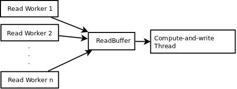
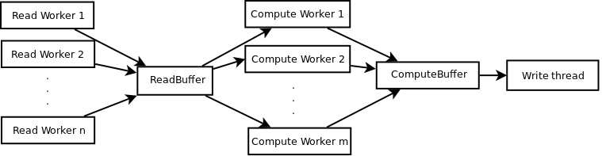
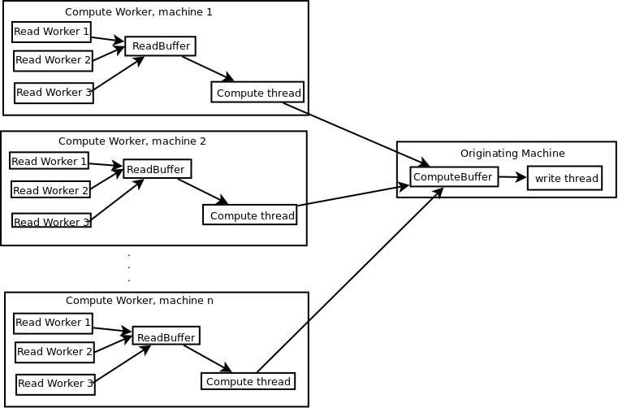

====================
Concurrency Diagrams
====================

The diagrams shown below describe the processing model(s) and the flow of
data when RIOS is running with some form of concurrency enabled.

Read Worker Threads
-------------------
This is the simplest form of concurrency, and often the most useful. One or
more threads are started within the main process, each one reading parts
of the input files. The data is placed in the ReadBuffer. The 
compute-and-write thread takes data from the ReadBuffer, computes outputs
and writes to the output files.

Read and Compute Worker Threads
-------------------------------

This is the more general form, where there are multiple threads collaborating
in both reading and computation tasks, and feeding the resulting data to
the main thread for output. Read workers place data in the ReadBuffer, and the 
compute workers take it from there as it becomes available. They place 
completed output data in the ComputeBuffer, from which the write thread
takes it, writing it to output files.

Compute Across Multiple Machines
--------------------------------
This is more complex, and currently considered somewhat experimental. Compute
workers are spread across multiple machines in a cluster. Each worker machine
can run one or more read worker threads of its own, reading the data which 
will be used by that compute worker. All output data is sent directly back to
the main thread for output.

